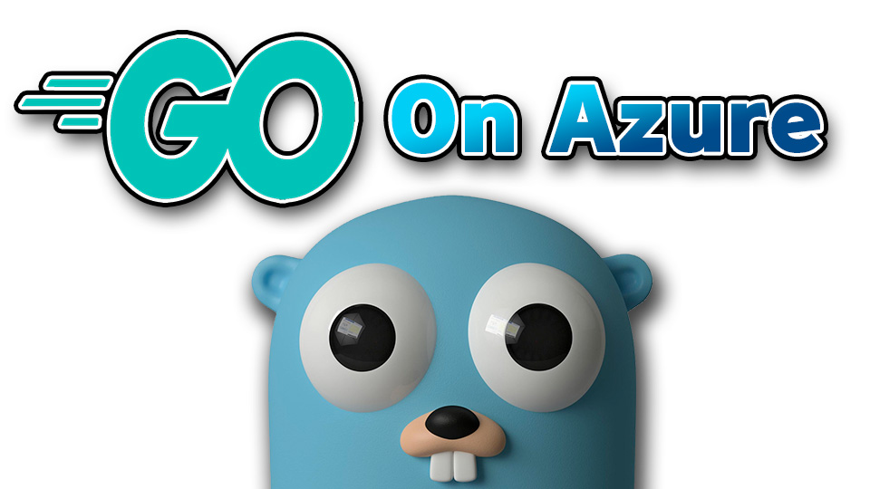

# Go on Azure App Service

View the running app -> https://go-azure-appservice.azurewebsites.net 😎

This is an example repo of how to get a Go / Golang app using the Gin web framework running natively on Azure App Service WITHOUT using a Docker container.

This is not natively supported out of the box (in fact, support for building Go on Kudu / App Service [was removed waaay back in 2017](https://github.com/Azure/app-service-announcements/issues/45)).

HttpPlatformHandler is used to serve the app. This is set up in web.config.

Github Actions are used build the app, copy static assets and push the app to Azure App Service.

Main.go has a couple of tweaks to support running on Azure App Service:

- The correct forwarding port is loaded from the "HTTP_PLATFORM_PORT" environment variable.
- A file watcher is set up to look for "App_offline.htm" and terminate the application if present. This file is added during the WebDeploy Github Action. This is required because otherwise the executable will be locked during subsequent deployments. (.NET apps handle this using the AspNetCoreModule, which doesn't work here.)

### Attributions

Gopher 3D render Art by James4K - https://github.com/james4k/gopher. The original Go gopher was designed by Renee French. The design is licensed under the Creative Commons 3.0 Attributions license. Read this article for more details: http://blog.golang.org/gopher.
